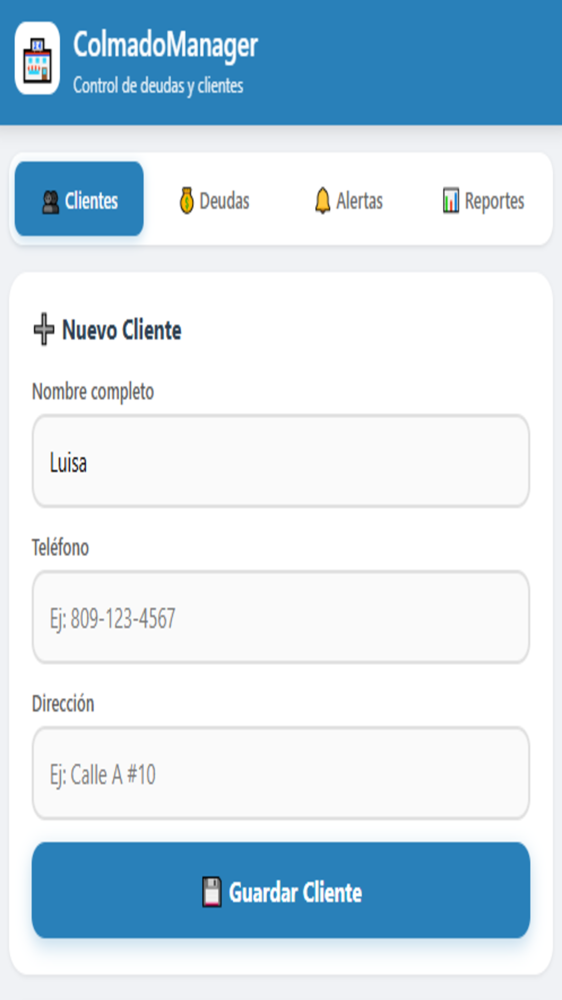
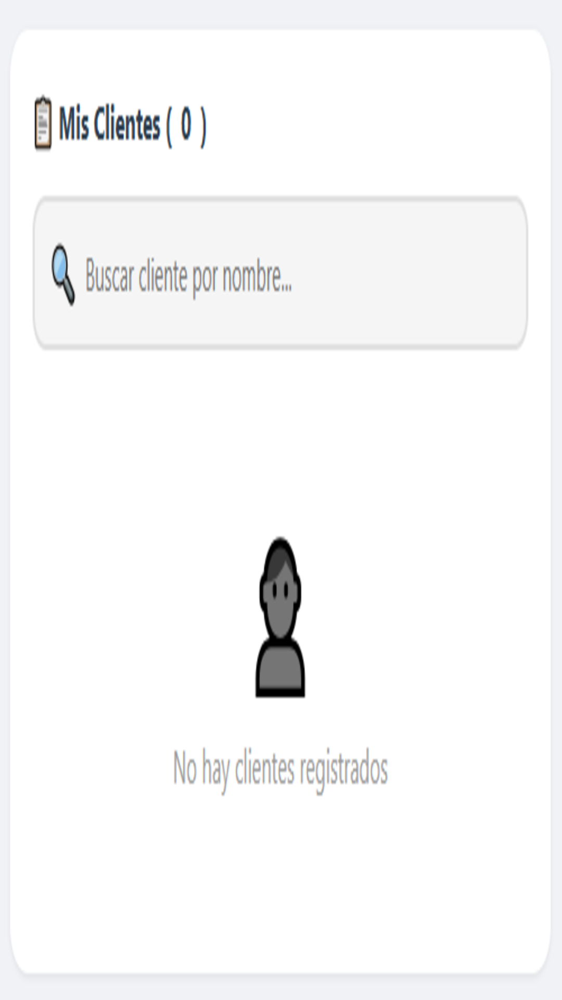
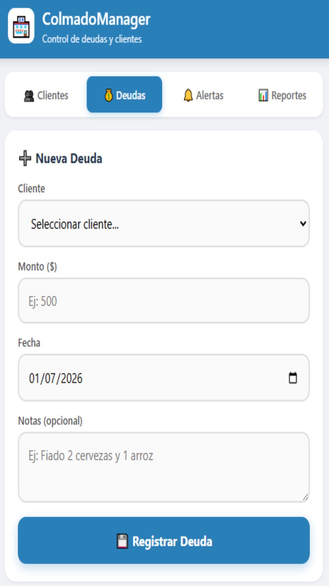
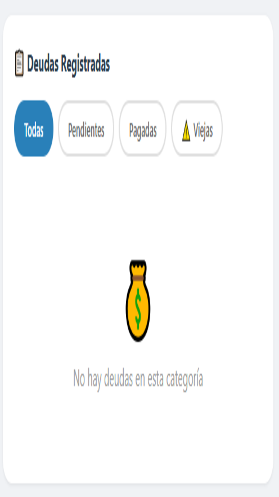
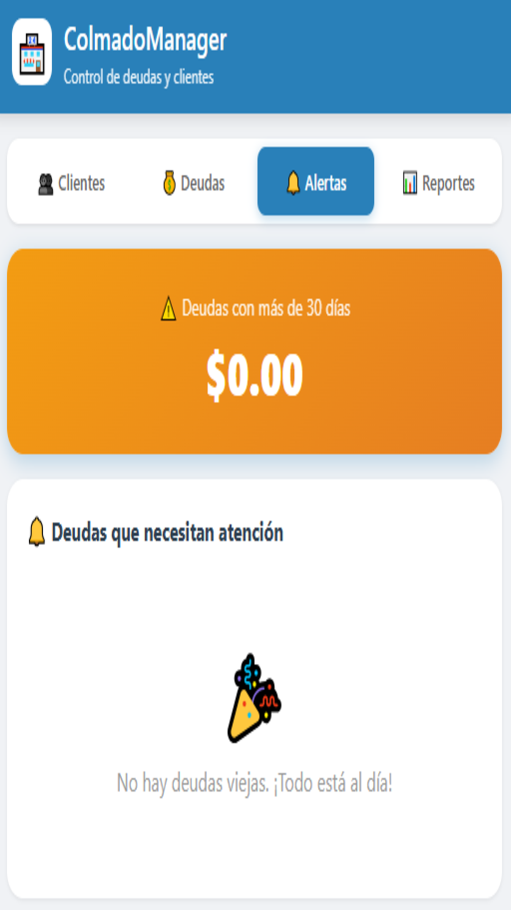
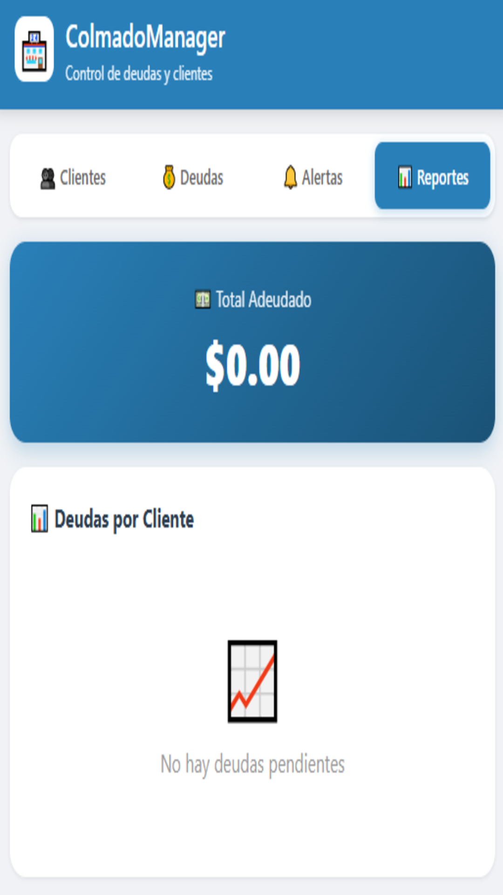

# 🏪 ColmadoManager

**Control de Deudas y Clientes para Colmados, Bodegas y Tiendas de Barrio**

[](https://colmadomanager.netlify.app)


---

## ¿Qué es ColmadoManager?

¿Tienes un colmado, bodega o tienda de barrio? ¿Te cansaste de anotar fiados en papel y perder el control?

**ColmadoManager** es la app que necesitas para llevar el control de tus deudas y clientes de forma **simple, rápida y sin complicaciones**.

---

## ✅ ¿Qué puedes hacer?

| Función | Descripción |
|---------|-------------|
| 👥 **Clientes** | Registra todos tus clientes con nombre, teléfono y dirección |
| 💰 **Deudas** | Anota deudas en segundos con fecha y notas |
| 📊 **Reportes** | Ve cuánto te deben en total y por cada cliente |
| 🔔 **Alertas** | Recibe alertas de deudas viejas (+30 días) |
| 🔍 **Búsqueda** | Busca clientes por nombre al instante |
| ✓ **Pagos** | Marca deudas como pagadas con un toque |
| 📴 **Offline** | Funciona 100% SIN INTERNET |

---

## 🎯 Diseñado para colmados

Sabemos que en un colmado no hay tiempo para apps complicadas. Por eso ColmadoManager es:

- ⚡ **Súper fácil de usar** — No necesitas ser experto en tecnología
- 🚀 **Rápido** — Registra una deuda en 3 segundos
- 📱 **App nativa** — Se ve y funciona como una app real
- 🏠 **Instalable** — Se queda en tu pantalla de inicio

---

## 💾 Tus datos, contigo

- ✅ Todo se guarda en tu celular (localStorage)
- ✅ No necesitas internet
- ✅ No necesitas crear cuenta
- ✅ No pierdes información

---

## 📱 Instalación

### Desde el navegador (Chrome/Edge/Samsung)
1. Visita la app en tu navegador
2. Aparecerá un mensaje **"Agregar a pantalla de inicio"**
3. ¡Listo! Funciona como app nativa

### Manual
1. Abre el menú del navegador (⋮)
2. Selecciona **"Agregar a pantalla de inicio"** o **"Instalar app"**
3. Confirma y aparecerá el icono 🏪

---

## 🛠️ Tecnologías

- **HTML5** — Estructura semántica
- **CSS3** — Diseño responsive y moderno
- **JavaScript Vanilla** — Sin frameworks, ligero y rápido
- **PWA** — Progressive Web App, funciona offline
- **Service Worker** — Cache para funcionar sin internet
- **LocalStorage** — Almacenamiento local de datos

---

## 🚀 Demo en vivo

🔗 **[https://colmadomanager.netlify.app](https://colmadomanager.netlify.app)**

---

## 📸 Screenshots

| Clientes | Deudas | Alertas |
|----------|--------|---------|
|  |  |  |

| Reportes | Búsqueda | Diseño |
|----------|----------|--------|
|  |  |  |

---

## 📂 Estructura del proyecto

```
colmado-manager/
├── index.html          # App principal
├── manifest.json       # Configuración PWA
├── sw.js               # Service Worker (offline)
├── icon-192.png        # Icono pequeño
├── icon-512.png        # Icono grande
├── screenshot1.png     # Capturas para stores
├── screenshot2.png
├── screenshot3.png
├── screenshot4.png
├── screenshot5.png
└── screenshot6.png
```

---

## 🔄 Actualizar la app

Como es una PWA, la app se actualiza automáticamente cuando:
- Hay conexión a internet
- El Service Worker detecta cambios
- El usuario recarga la app

---

## 🤝 Contribuir

¿Quieres mejorar ColmadoManager? ¡Eres bienvenido!

1. Fork el repositorio
2. Crea una rama (`git checkout -b feature/nueva-funcion`)
3. Commit tus cambios (`git commit -m 'Agrega nueva función'`)
4. Push a la rama (`git push origin feature/nueva-funcion`)
5. Abre un Pull Request

---

## 📝 Roadmap

- [x] Registro de clientes
- [x] Control de deudas
- [x] Alertas de deudas viejas
- [x] Búsqueda de clientes
- [x] Reportes por cliente
- [ ] Exportar a Excel/CSV
- [ ] Backup en la nube (opcional)
- [ ] Múltiples usuarios
- [ ] Recordatorios por WhatsApp


---

## 💬 Contacto

¿Preguntas, sugerencias o problemas?

- Abre un [Issue](https://github.com/Bredalis/ColmadoManager/issues)
- Escríbenos a: **bredalisgautreaux@gmail.com**

---

<p align="center">
  <b>ColmadoManager</b> — porque controlar lo que te deben no debería ser más difícil que venderlo.
</p>

<p align="center">🏪 Hecho con ❤️ para los colmados de República Dominicana y el mundo</p>
